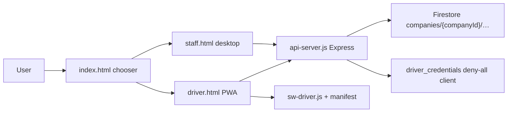

# Poglavlje 1 — Data-flow / mapa sistema (skica)

Datum: 2026-07-24  
Grana: `work/master-prompt-ch1`

## Površine



## Uloge → ulaz

| Uloga | Surface | Auth | Tipične sekcije |
|-------|---------|------|-----------------|
| driver | `driver.html` | PIN / aktivacija | dashboard, calendar, reports, messages, SOS |
| dispatcher | `staff.html` | email | ops, daily, monthly, messages, reports, map |
| company-admin | `staff.html` | email | CA overview…settings, plans, team, drivers |
| superadmin | `staff.html` | PIN / logo | companies, overview, status |

UI gate: `js/core/ui-permissions.js` + `canOpenSection`.  
Server gate: middleware u `api-server.js` (`requireOwnCompany`, role helpers).  
Rules: `firestore.rules`.

## Kanonski tokovi (trenutno stanje)

### A) Katalog smena (CA)

```
Upload XLSX|CSV|BC-PDF
  → client parse (js/imports/service-plan-*)
  → preview API
  → publish API (server/service-plans.js)
  → companies/{id}/service_plans (+ supersede)
  → client line-shift-catalog / service-plan.js
```

### B) Operativni roster (dispo)

```
Daily UI (daily-plan / ops)
  → persistShift → PUT /api/staff/shifts/assignment
  → companies/{id}/shifts (+ audit shift_assigned)
  → syncShiftToMonthlyPlan (client schedules)

Monthly UI (monthly-plans)
  → često saveState() direktno na schedules  ⚠ dual write path
```

### C) Potvrda smene (vozač)

```
Driver session
  → evaluateDriverWorkPolicy (server/driver-work-policy.js)
  → confirmation targets (Fri packaging)
  → POST /api/driver/shift-confirmations
  → fingerprint na dodeli
Nema: push/job scheduler
```

### D) Aktivacija vozača (trenutno)

```
CA import CSV → profile + loginCodeHash(TEMPORARY 123456) + companyCodeHash
  → driver login temp
  → activate-company-code (CA-supplied firm code)
  → mustChangeLoginCode cleared
Cilj master prompta: unique OTP 24h + SMS + self-chosen code  — još nije
```

### E) GPS

```
Driver work window → gps-track.js (browser geolocation on currentUser)
Dispatcher map → live-map-core.js SIMULATION paths  ⚠ nije live GPS feed
```

## Multi-tenant pattern

- Path: `companies/{companyId}/…`
- Token `companyId` mora da se poklopi (`requireOwnCompany`)
- Sensitive: `driver_credentials` client deny-all
- Public slabost: `GET /api/public/companies/:id/drivers` (id+name) — dokumentovati kao privacy rizik

## Audit

- Server `server/audit-log.js` + CA audit UI
- Pokrivenost svih kritičnih akcija: PARTIAL (nije dokazan 100% coverage)

## Šta data-flow još nije

- Jedan roster dokument/model sa version/ETag
- Incident/solution kao plan entitete
- Idempotentni notification/scheduler sloj
- Support session (SA) sa TTL + audit
